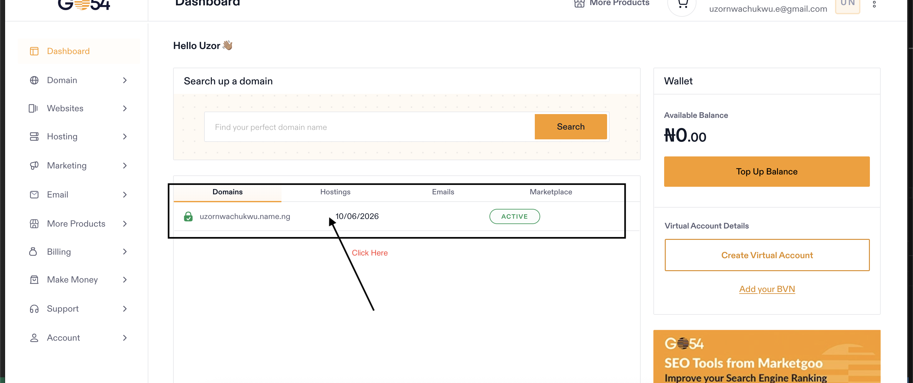
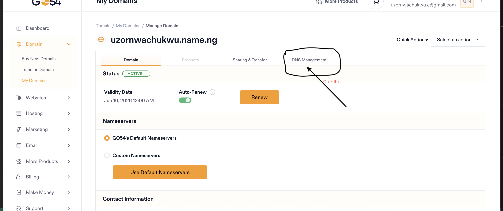
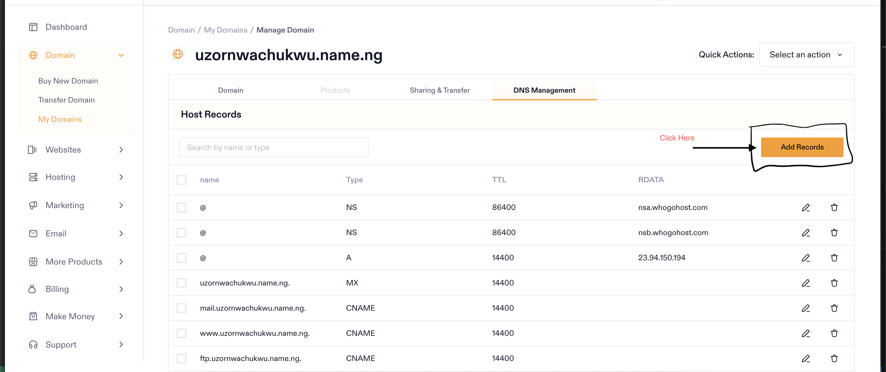
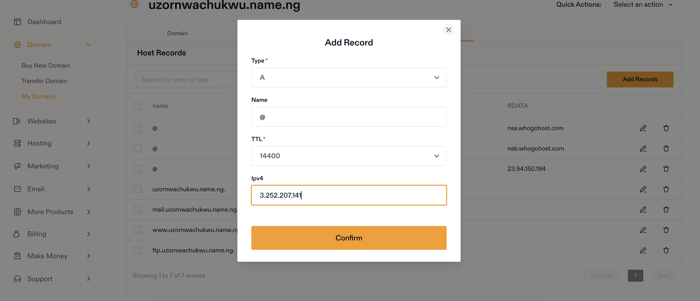

# Second Semester Exam
## Step 1: Provisioning the Server (AWS EC2)
1. Log into to the AWS Console [here](https://console.aws.amazon.com/console/home?nc2=h_ct&src=header-signin)
2. On the home page under the recently visited section, select EC2
3. Click on the "Launch Instance" action button which opens up the instance setup page
4. Under the "Name and tag" session provide the instance name, in my case "Altschool-Second-Semester-Exam"
5. Under the "Application and OS Images (Amazon Machine Image)" section, select "Ubuntu". <br />
<strong>NOTE -</strong> Ensure you select an image that is eligible for free tier. In my case, I selected "Ubuntu Server 24.04 LTS(HVM), SSD Volume Type"
6. Under the "Instance Type", select "t2.micro" which is eligible for free tier
7. Under the "Key pair (Login)" section, click on "Create a Key Pair"
8. In the action menu that pops up
- Add a key pair name, in my case "Final-Exam-Key"
- In the Key pair type, select RSA
- In the Private key format, keep as .pem
- Click on "Create key pair" to create and download the key to local device
9. In the "Network Settings" section, under the "Firewall (security groups)" subsection select "Create security group" and under the rules, select
- Allow SSH traffic from anywhere (Default)
-  Allow HTTPS traffic from the internet
- Allow HTTP traffic from the internet
10. Under the "Configure storage" section, keep the default
11. Click on "Launch Instance to Finish"

## Step 2: Web Server Setup
1. Locate the created instance by clicking on the "Instances" button on the side bar. The instance name will be clearly shown in a table
2. Click on the instance ID to open up "Instance Summary" menu
3. Click on the "Connect" button to open up the connection options page. Select "SSH client" tab from the options
4. Follow the instruction provided to connect the instance to your local system via SSH <br />
<strong>NOTE - </strong> The SSH key create earlier must be on the local system
- Open a terminal on the local system
- Change the the permission of the .pem file downloaded to your local system to only allow read access for the owner:<br />
```
chmod 400 <path-to-key-file>
```
- Connect to the instance using this syntax: <br />
```
ssh -i <path-to-key-file> <ec2-username>@<ec2-public-dns>
```
5. Once connected to the remote machine, update the package index using the command 
```
sudo apt update
```
6. Install nginx using the command: <br />
```
sudo apt install nginx
```
7. Check if nginx is running: <br />
```
systemctl status nginx
```
8. Copy the contents of the local code file to the EC2 server using the command:
```
scp -P 22 -i <path-to-key-file> -r <path-to-source-code-on-local-system> <ec2-username>:<ec2-public-dns>:<absolute-path-to-destination-location>
```
9. Copy the html file, css and any Javascript file from the location on the EC2 instance to the /var/www/html folder using the command: <br />
```
cp -r <source-folder>/* /var/www/html
```
10. Restart nginx using the command: <br />
```
systemctl restart nginx
```

## Step 3 (Optional): Set Up Reverse Proxy
1. Copy the contents of the "server" folder from the local machine to remote machine, use "rsync" command in order to exclude the node_module folder <br />
```
rsync -avz --exclude 'node_modules' -e "ssh -i Final-Exam-Key-Pair.pem -p 22" ../coding/altschool/second-semester-cloud/second-semester-exams/server ubuntu@ec2-3-252-207-141.eu-west-1.compute.amazonaws.com:/home/ubuntu/
```

2. Download the deb file for node 20 as the node version in the ubuntu package index might be outdate: <br />
```
curl -fsSL https://deb.nodesource.com/setup_20.x | sudo -E bash -
```

3. Install the download package:
```
sudo apt install -y nodejs
```
Confirm the downloaded node version using:
```
node -v
```

4. Install PM2 to manage the application and ensure it always restarts when the server starts up: <br />
```
npm install -g pm2
```

5. Start the proxy server using pm2
```
pm2 start app.js --name proxy-server
```
6. Save the current process list
```
pm2 save
```
7. Enable pm2 start the process on server reboot
```
pm2 startup
```
Save again <br />
```
pm2 save
```
8. In order to serve the html file statically from the node app reverse proxy add the following line to the express app
```
const LANDING_PAGE_PATH = process.env.LANDING_PAGE_PATH;

app.use("/second-semester-exam", express.static(LANDING_PAGE_PATH));

app.get("/second-semester-exam/{*any}", (_req, res) => {
  res.sendFile(path.join(LANDING_PAGE_PATH, "index.html"));
});
```

9. Create a ".env" file at the root of the server folder and add
```
PORT=8080
LANDING_PAGE_PATH=/var/www/html/final-project
```
This way we can dynamically provide the landing page page source folder.

10. Restart the application
```
pm2 reload proxy-server --update-env
```
11. Edit the ngnix.conf file to allow this application to be accessible:
```
http {
    ...
    server {
		listen 80;
		server_name ec2-3-252-207-141.eu-west-1.compute.amazonaws.com;
		location /final-project {
			alias /var/www/html/final-project/;
			index index.html;
		}
		location /proxy/ {
        		proxy_pass http://localhost:8080/;
        		proxy_http_version 1.1;
        		proxy_set_header Upgrade $http_upgrade;
        		proxy_set_header Connection 'upgrade';
        		proxy_set_header Host $host;
        		proxy_cache_bypass $http_upgrade;
    		}

		location /second-semester-exam {
			proxy_pass http://localhost:8080;
			proxy_http_version 1.1;
			proxy_set_header Upgrade $http_upgrade;
			proxy_set_header Connection 'upgrade';
			proxy_set_header Host $host;
			proxy_cache_bypass $http_upgrade;
		}

	}
    ...
}
``` 
12. Restart nginx to use this updated configuration:
```
sudo systemctl restart ngnix
```
Now the page is accessible via:
- The Proxy server [http://ec2-3-252-207-141.eu-west-1.compute.amazonaws.com/proxy/second-semester-exam](http://ec2-3-252-207-141.eu-west-1.compute.amazonaws.com/proxy/second-semester-exam)
- Directly from nginx [http://ec2-3-252-207-141.eu-west-1.compute.amazonaws.com/final-project](http://ec2-3-252-207-141.eu-west-1.compute.amazonaws.com/final-project)


## Step 4 (Optional): SSL Setup
To set up SSL on the EC2 instance follow these steps:
1. Purchase a domain from an hosting service provider e.g [whogohost](https://www.whogohost.com/). I was able to get uzornwachukwu.name.ng for under N600.
2. Log into the domain name provider's website and locate the domains sections, here you will a list of your registered domain.
3. Click on the domain you want to connect to EC2 instance, this opens up more details about the domain

4. In the details page, click on the "DNS Management Tab". This open a popup to set up a DNS record.

5. Click on the "Add Record" CTA

This pops up a form to add a new record:

The ipv4 address should be the public ipv4 address of your ubuntu EC2 instance.<br />
To Get this
	1. Log into to AWS management console.
	2. Locate the EC2 instance on the "Instances" table and copy the public IPv4 address

6. Connect to your EC2 instance using SSH
7. Edit the default sites available file in nginx located at "/etc/nginx/sites-available/default" and add this line to your server_name directive:
```
server_name uzornwachukwu.name.ng;

location /.well-known/acme-challenge/ {
		allow all;
		root /var/www/html;
	}
```
So the main server block looks like this:
```
server {
        listen 80 default_server;
        listen [::]:80 default_server;

        root /var/www/html;

        index index.html index.htm index.nginx-debian.html;

        server_name uzornwachukwu.name.ng;

		location /.well-known/acme-challenge/ {
		allow all;
		root /var/www/html;
		}

    location / {
                # First attempt to serve request as file, then
                # as directory, then fall back to displaying a 404.
                try_files $uri $uri/ =404;
        }
}
```
8. Add the registry that contains certbot to your local package index
```
sudo add-apt-repository ppa:certbot/certbot
```
9. Then update package index
```
sudo apt update
```
10. Install certbot:
```
sudo apt install certbot python3-certbot-nginx 
```
11. Add the SSL certificate to the domain name configure using the command:
```
sudo certbot --nginx -d uzornwachukwu.name.ng
```
12. Edit the default nginx.conf file and add the server_name block to the main server directive
```
server_name uzornwachukwu.name.ng;
```

13. Add a second server block for https connection:
```
server {
        listen 443 ssl;
        server_name uzornwachukwu.name.ng;

        ssl_certificate /etc/letsencrypt/live/uzornwachukwu.name.ng/fullchain.pem;
        ssl_certificate_key /etc/letsencrypt/live/uzornwachukwu.name.ng/privkey.pem;

        location /final-project {
            alias /var/www/html/final-project/;
            index index.html;
        }

        location /proxy/ {
            proxy_pass http://localhost:8080/;
            proxy_http_version 1.1;
            proxy_set_header Upgrade $http_upgrade;
            proxy_set_header Connection 'upgrade';
            proxy_set_header Host $host;
            proxy_cache_bypass $http_upgrade;
        }

        location /second-semester-exam {
            proxy_pass http://localhost:8080/second-semester-exam;
            proxy_http_version 1.1;
            proxy_set_header Upgrade $http_upgrade;
            proxy_set_header Connection 'upgrade';
            proxy_set_header Host $host;
            proxy_cache_bypass $http_upgrade;
        }
    }
```
My final nginx.conf file looks like this:
[Nginx Config](./nginx.conf)

Now my Final Project is available either through:
1. Without Proxy <br />
[https://uzornwachukwu.name.ng/final-project/](https://uzornwachukwu.name.ng/final-project/)
2. With a node app as proxy<br/>
[https://uzornwachukwu.name.ng/proxy/second-semester-exam/](https://uzornwachukwu.name.ng/proxy/second-semester-exam/)